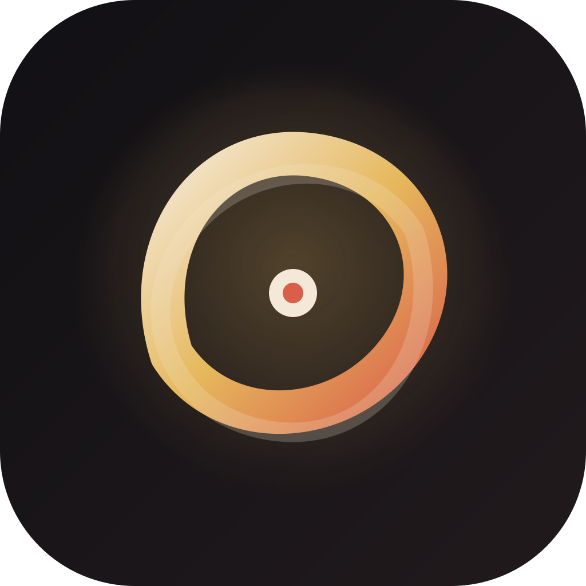

<div align="center">


# Seanbot

**你的全能代理。** 说清楚你要什么，剩下的交给它。


</div>

界面是行内 TUI：流式 Markdown 回复写进终端滚动区，`/` 弹出命令浮窗，`Ctrl+O` 查看完整转录（工具结果可展开），改动类工具有确认框，还有吉祥物"环环"。单轮提问仍用 `sean -p "问题"`。

官网（自动识别你的系统、下载与产品预览）：<https://yxxbc.github.io/Seanbot/>

## 安装

macOS / Linux：

```bash
curl -fsSL https://raw.githubusercontent.com/yxxbc/Seanbot/main/scripts/install.sh | sh
```

Windows（PowerShell）：

```powershell
irm https://raw.githubusercontent.com/yxxbc/Seanbot/main/scripts/install.ps1 | iex
```

装好之后，升级用 `sean update`（macOS / Linux）。

可选环境变量：`SEANBOT_VERSION`（指定版本）、`SEANBOT_INSTALL_DIR`（安装目录）。

## 关于这个项目

请问你的`Seanbot`，它会知道的。

## 开发

```bash
scripts/test.sh             # 格式、clippy、测试与脚本测试（--fix 先自动修复）
scripts/release.sh 0.2.0    # 一键发版：改版本号与更新日志、打标签、推送后由 CI 构建并发布 Release
```

---

<div align="center">



**Seanbot** · 你的全能代理

Made with 🦀 Rust · [GitHub](https://github.com/yxxbc/Seanbot)

</div>
